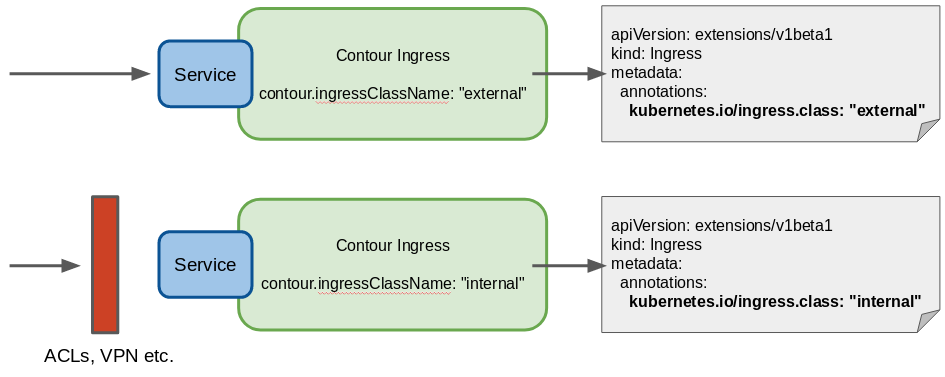

This repository contains a Helm chart for the Contour/Envoy ingress controller
with support for customizing the ingress class name and hence run two ingress
controllers on two externally exposed services.

## Why Contour?

Because Contour is based on Envoy, the CNCF 'graduated' dataplane. This is
contrary to e.g. Nginx and Traefik, which basically are solutions from
commercial companies.

## Use Case

The use-case for this is internal and external services with e.g. ACLs limiting
access to the internal services, which is illustrated below.

## Deployment

An example deployment is shown in the [Helmsman deployment
file](deployment/helmsman.yaml), and example workload in the `example-workload`
folder.

The repository is a fork of Helm stable charts [PR
7385](https://github.com/helm/charts/pull/7385), with the following changes/fixes:

- ClusterRole naming error caused deployment to not work.
- Support for configuring ingress class name
- Correction for Contour Prometheus metrics

